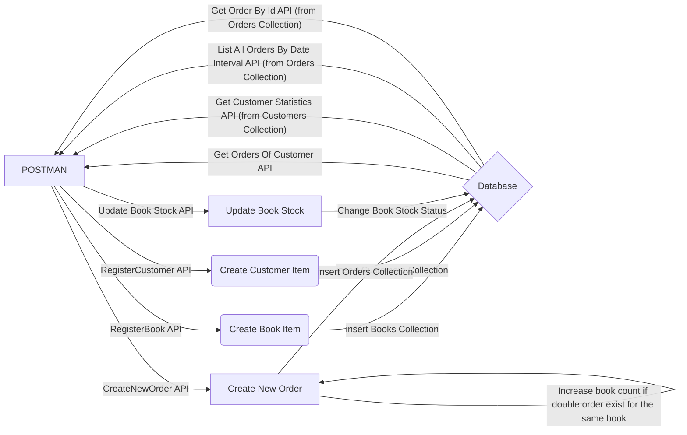

# ReadingIsGood App
### An online books retail system
### Tech Stack
* **Spring Boot**
* **Mongo DB**
* **Mongo Express Server**
* **Docker**
* **Mockito**
### Project Design Stages and Application Graph

Foreseeing a domain driven development, I first drew a graph like the one below in order to explain the dependencies and 
inter-service communication in the project. I started by designing the Data models that will be used later. 
These data models had to be loosely coupled from each other. Then I started developing the application by 
writing the services and controllers necessary to create the Customer and Book records required to operate the scenarios.



### Project Setup

First of all, Docker should be installed to get the project up and running.
> Docker can be installed from [here](https://docs.docker.com/desktop/mac/install/)
* After the project is downloaded, in the project directory run the command below :
```bash  
docker compose up
```  
> After docker is up, the application will boot on the http://127.0.0.1:8080 port.

All db connections and application configurations are set in docker-compose.yml file.
In other words, ReadingIsGood application works in a usable way without the need for any adjustments.

> If the application is wanted to be stopped, after terminates the app with cmd+C (ctrl+C on windows), below command is enough :

```bash  
docker compose down
```  
### Curls

1. Each progress must be operated with its associated API's
    * **Register Customer API**
      ```
      curl --location --request POST 'http://127.0.0.1:8080/retail/rest/customer' \
      --header 'Accept: application/json' \
      --header 'Content-Type: application/json' \
      --data-raw '{
          "firstName" : "Enes",
          "lastName" : "Koçak",
          "email" : "ekones@gmail.com",
          "gender" : "MALE",
          "address" : {
             "country": "Turkey",
             "city": "İstanbul",
             "postCode": "34410"
          }
      }'
      ```
    * **Get Orders Of Customer API**
      ```
      curl --location --request GET 'http://127.0.0.1:8080/retail/rest/customer-orders' \
      --header 'Accept: application/json' \
      --header 'Content-Type: application/json' \
      --data-raw '{
         "customerId": "62984e611f0aa76dc34c77a0",
         "page": 0,
         "size": 3
      }'
      ```
    * **Get Customer Statistics API**
      ```
      curl --location --request GET 'http://127.0.0.1:8080/retail/rest/statistics' \
      --header 'Accept: application/json' \
      --header 'Content-Type: application/json' \
      --data-raw '{
         "customerId": "62984e611f0aa76dc34c77a0"
      }'
      ```
    * **List All Orders By Date Interval API**
      ```
      curl --location --request GET 'http://127.0.0.1:8080/retail/rest/orders' \
      --header 'Accept: application/json' \
      --header 'Content-Type: application/json' \
      --data-raw '{
         "startDate": "2022/05/12 01:00:00",
         "endDate": "2022/06/03 03:50:39"
      }'
      ```

    * **Get Order By Id API**
      ```
      curl --location --request GET 'http://127.0.0.1:8080/retail/rest/order' \
      --header 'Accept: application/json' \
      --header 'Content-Type: application/json' \
      --data-raw '{
         "orderId": "6298558fa1dd2770ce4fe8fc"
      }'
      ```

    * **Register Book API**
      ```
      curl --location --request POST 'http://127.0.0.1:8080/retail/rest/book' \
      --header 'Accept: application/json' \
      --header 'Content-Type: application/json' \
      --data-raw '{
         "bookName": "temp",
         "totalPage": 250,
         "author": "Knut Hamsun",
         "genre":"dram",
         "stock":50,
         "price":34.33
      }'
      ```

    * **Create New Order API**
      ```
      curl --location --request POST 'http://127.0.0.1:8080/retail/rest/order' \
      --header 'Accept: application/json' \
      --header 'Content-Type: application/json' \
      --data-raw '{
         "customerId": "62984e611f0aa76dc34c77a0",
         "bookId": "629667ed87b2cd36f3e80968",
         "count":3,
         "status": 2
      }'
      ```

    * **Update Book Stock API**
      ```
      curl --location --request PUT 'http://127.0.0.1:8080/retail/rest/book' \
      --header 'Accept: application/json' \
      --header 'Content-Type: application/json' \
      --data-raw '{
         "bookId": "629667ed87b2cd36f3e80968",
         "stock":100
      }'
      ```
      
## Tests
Tests can be seen in project folder.
